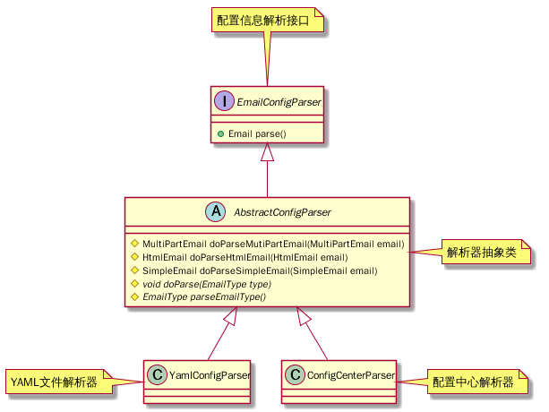

# common-email ](https://travis-ci.org/wuxinbo/common-email.svg?branch=master) [](https://coveralls.io/github/wuxinbo/common-email?branch=dev) [](https://bettercodehub.com/)
## 介绍
本项目主要是对[apache-common-email](http://commons.apache.org/proper/commons-email)的邮件发送功能进行简单封装.
抽象邮箱配置逻辑，尽量做到靠配置文件来控制邮件的发送类型。在当前的版本中实现了支持解析[YAML](http://yaml.org/).
## java Doc
[javaDoc](https://apidoc.gitee.com/xbwuc/common-email/)
## 配置方式
1. [YAML](http://yaml.org/)(已经实现)
2. [JSON](https://www.json.org/json-zh.html)(规划中)
3. CONFIG_CENTER(基于spring框架的配置中心,暂未实现)  
...
## 关键类关系图

## 引用
目前jar已经推送到中央仓库可以通过下列方式引用：
```xml
<dependency>
  <groupId>com.github.wuxinbo</groupId>
  <artifactId>common-email</artifactId>
  <version>1.0.0</version>
</dependency>
```
[gradle](https://gradle.org/)
```groovy
compile 'com.github.wuxinbo:common-email:1.0.0'
```


